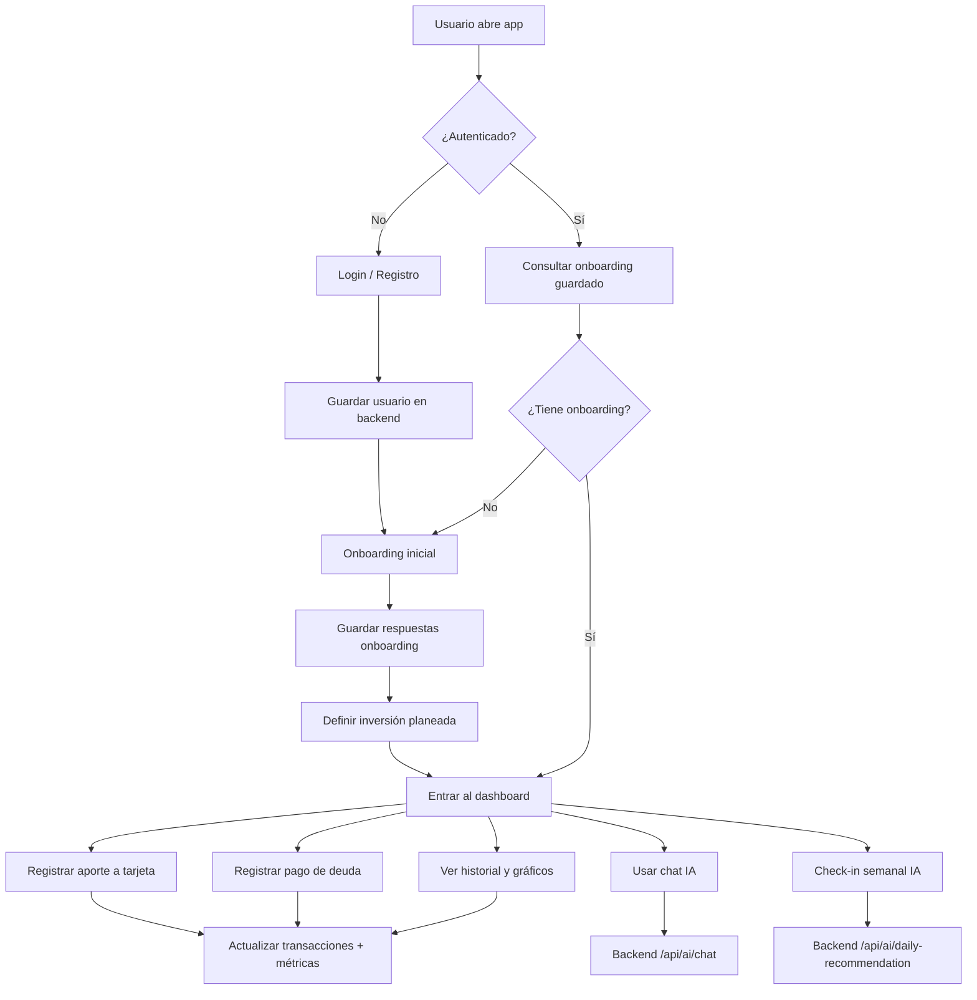

# Tarjetas de Ahorro (Frontend + Backend)

Esta app te ayuda a **organizar ahorro, deudas y hábitos financieros** con un flujo simple:
1. Te registras/inicias sesión.
2. Respondes onboarding.
3. Defines plan mensual.
4. Registras movimientos (ahorro/deuda).
5. Ves métricas e insights.
6. Pides ayuda a IA cuando lo necesites.

## ¿Dónde está cada cosa?

- `App.js`: pantalla principal y orquestación de estados/flujo.
- `components/`: bloques UI reutilizables (cards, modales, headers).
- `data/`: catálogos base (tips diarios, tarjetas iniciales).
- `utils/`: funciones auxiliares de formato y fechas.
- `backend/`: API FastAPI (auth, deudas, IA).

## Diagrama de flujo general



## Flujo técnico rápido

- Frontend (Expo/React Native) calcula métricas locales de progreso, puntos y distribución.
- Backend (FastAPI) resuelve autenticación, onboarding y llamadas a OpenAI.
- La URL del backend se obtiene por entorno:
  - `EXPO_PUBLIC_BACKEND_URL` (si la defines manualmente)
  - Android emulador: `http://10.0.2.2:8000`
  - Web: `http://localhost:8000`

## Cómo correr el proyecto

### Frontend

```bash
npm install
npm run start
```

### Backend

```bash
cd backend
python -m venv .venv
source .venv/bin/activate
pip install -r requirements.txt
uvicorn main:app --reload --host 0.0.0.0 --port 8000
```

> Para más detalle de variables de entorno y endpoints del backend, revisa `backend/README.md`.
